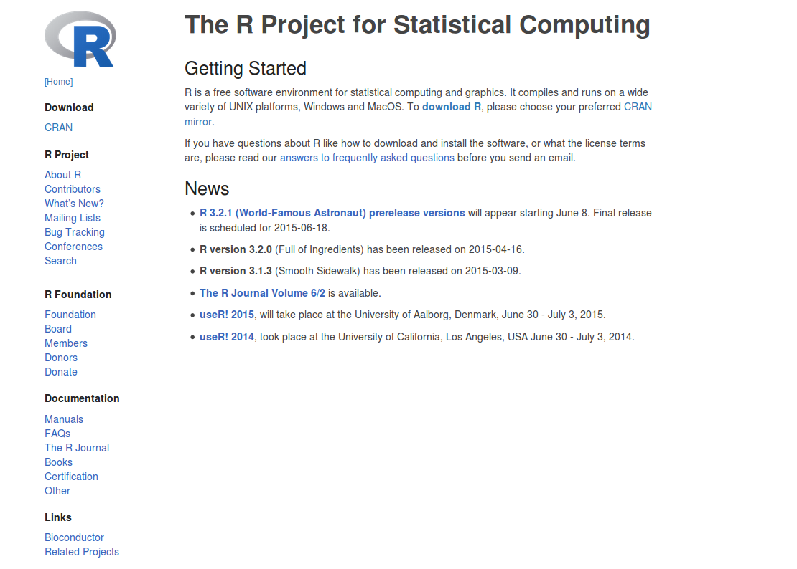
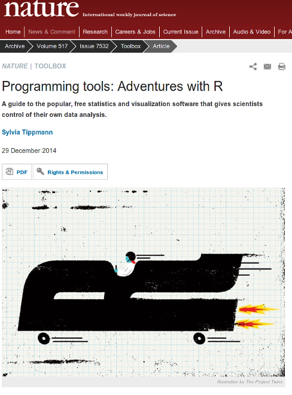

##What's R?

* A statistical programming environment
    + based on 'S'
    + suited to high-level data analysis
* Open source and cross platform
* Extensive graphics capabilities
* Diverse range of add-on packages
* Active community of developers
* Thorough documentation


## The R-project page

http://www.r-project.org/



##R in the New York Times
http://goo.gl/pww4ZO


##R in Nature


##R plotting capabilities
http://spatial.ly/2012/02/great-maps-ggplot2/


##R plotting capabilities
https://www.facebook.com/notes/facebook-engineering/visualizing-friendships/469716398919


##Who uses R? Not just academics!
http://www.revolutionanalytics.com/companies-using-r

- Facebook
    + http://blog.revolutionanalytics.com/2010/12/analysis-of-facebook-status-updates.html
- Google
    + http://blog.revolutionanalytics.com/2009/05/google-using-r-to-analyze-effectiveness-of-tv-ads.html
- Microsoft
    + http://blog.revolutionanalytics.com/2014/05/microsoft-uses-r-for-xbox-matchmaking.html
- New York Times
    + http://blog.revolutionanalytics.com/2011/03/how-the-new-york-times-uses-r-for-data-visualization.html

## R can facilitate Reproducible Research


Sidney Harris - New York Times

##It is a hot topic at the moment

- Statisticians at MD Anderson tried to reproduce results from a Duke paper and unintentionally unravelled a web of incompetence and skullduggery
    + as reported in the ***New York Times***
    


##Hear the full account

- Very entertaining talk from Keith Baggerly in Cambridge, December 2010

<iframe width="560" height="315" src="https://www.youtube.com/embed/7gYIs7uYbMo" frameborder="0" allowfullscreen></iframe>

##Various platforms supported

- Release 3.2.2 (August 2015)
    + Base package and Contributed packages (general purpose extras)
    + `r length(XML:::readHTMLTable("http://cran.r-project.org/web/packages/available_packages_by_date.html")[[1]][[2]])` available packages as of `r date()`
- Download from http://mirrors.ebi.ac.uk/CRAN/
- Windows, Mac and Linux versions available
- Executed using command line, or a graphical user interface (GUI)
- On this course, we use the RStudio GUI (www.rstudio.com)
- Everything you need is installed on the training machines
- If you are using your own machine, download both R and RStudio


##Getting started

- R is a program which, once installed on your system, can be
launched and is immediately ready to take input directly from the
user
- There are two ways to launch R:
    + From the command line (particularly useful if you're quite
familiar with Linux; in the console at the prompt simply type `R`)
    + As an application called  (very good for beginners)
    
##Launching R Using RStudio

To launch RStudio, find the RStudio icon in the menu bar on the left
of the screen and click


##Basic concepts in R - command line calculation

- The command line can be used as a calculator. Type:

```{r basic-calc1}
2 + 2

20/5 - sqrt(25) + 3^2

sin(pi/2)

```

Note: The number in the square brackets is an indicator of the
position in the output. In this case the output is a 'vector' of length 1
(i.e. a single number). More on vectors coming up...

##Basic concepts in R - variables

- A variable is a letter or word which takes (or contains) a value. We
use the assignment 'operator', `<-`

```{r variables1}
x <- 10
x
myNumber <- 25
myNumber
```
- We can perform arithmetic on variables:
```{r variables2}
sqrt(myNumber)
```
- We can add variables together:
```{r variables3}
x + myNumber
```

##Basic concepts in R - variables

- We can change the value of an existing variable:

```{r variables4}
x <- 21
x
```

- We can set one variable to equal the value of another variable:

```{r variables5}
x <- myNumber
x
```

- We can modify the contents of a variable:

```{r variables6}
myNumber <- myNumber + sqrt(16)
myNumber
```

##Basic concepts in R - functions

- **Functions** in R perform operations on **arguments** (the inputs(s) to the function). We have already used:
```{r eval=FALSE}
sin(x)
```
this returns the sine of x. In this case the function has one argument: **x**. Arguments are always contained in parentheses -- curved brackets, **()** -- separated by commas.

- Try these:

```{r functions1}
sum(3,4,5,6)
max(3,4,5,6)
min(3,4,5,6)
```

##Basic concepts in R - functions

- Arguments can be named or unnamed, but if they are unnamed they must be ordered (we will see later how to find the right order)
      + when testing code, it is easier and safer to name the arguments

```{r functions2}
seq(from = 2, to = 20, by = 4)
seq(2, 20, 4)
```

##Basic concepts in R - vectors

- The basic data structure in R is a **vector** -- an ordered collection of values. 
- R treats even single values as 1-element vectors. 
- The function `c` *combines* its arguments into a vector:

```{r vectors1}
x <- c(3,4,5,6)
x
```
- The square brackets `[]` indicate the position within the vector (the ***index***). We can extract individual elements by using the `[]` notation:
```{r vectors2}
x[1]
x[4]
```

- We can even put a vector inside the square brackets: (*vector indexing*)

```{r vectors3}
y <- c(2,3)
x[y]
```

##Basic concepts in R - vectors
- There are a number of shortcuts to create a vector. Instead of:
```{r vectors4}
x <- c(3,4,5,6,7,8,9,10,11,12)
```
- we can write:
```{r vectors5}
x <- 3:12
x
```
- or we can use the `seq()` function, which returns a vector:
```{r vectors6}
x <- seq(2, 20, 4)
x
```

```{r vectors7}
x <- seq(2, 20, length.out=5)
x
```


##Basic concepts in R - vectors
- or we can use the `rep()` function:

```{r vectors8}
y <- rep(3, 5)
y
```

```{r vectors9}
y <- rep(1:3, 5)
y
```


##Basic concepts in R - vectors
- We have seen some ways of extracting elements of a vector. We can use these shortcuts to make things easier (or more complex!)

```{r vectors10}
x <- 3:12
x[3:7]
x[seq(2, 6, 2)]
x[rep(3, 2)]
```


##Basic concepts in R - vectors
- We can add an element to a vector:
```{r vectors11}
y <- c(x, 1)
y
```
- We can glue vectors together:
```{r vectors12}
z <- c(x, y)
z
```

##Basic concepts in R - vectors
- We can remove element(s) from a vector:
```{r vectors13}
x <- 3:12
x[-3]
x[-(5:7)]
x[-seq(2, 6, 2)]
```

##Basic concepts in R - vectors

- Finally, we can modify the contents of a vector:
```{r vectors14}
x[6] <- 4
x
x[3:5] <- 1
x
```

Remember! 
- **Square** brackets for ***indexing*** []
- **parentheses** for function ***arguments*** ().

##Basic concepts in R - vector arithmetic

- When applying all standard arithmetic operations to vectors,
application is element-wise

```{r vector-arithmetic1}
x <- 1:10
y <- x*2
y
z <- x^2
z
```

##Basic concepts in R - vector arithmetic

- Adding two vectors
```{r vector-arithmetic2}
y + z
```
- If vectors are not the same length, the shorter one will be recycled:
```{r vector-arithmetic3}
x + 1:2
```
- But be careful if the vector lengths aren't factors of each other:

```{r eval=FALSE}
x + 1:3
```

```{r vector-arithmetic4,echo=FALSE}
options(width=50)
x + 1:3
```
