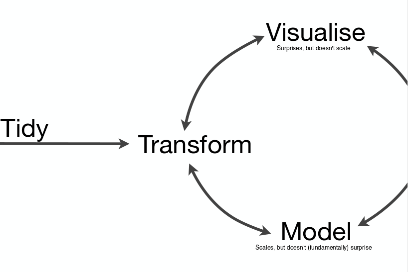
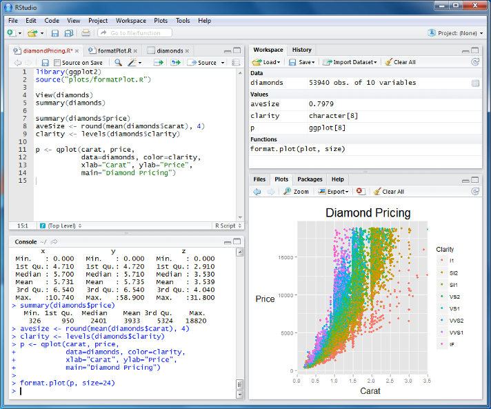

## Course outline

A data analysis can be broken-down into several stages. There is, however, no such thing as a typical analysis. Most datasets we will encounter will have their own issues and problems that need fixing. We will also need to spend a lot of time visualising our data in different ways in order to gain insights. Unfortunately, in R there are many hundreds (thousands!) of functions for us to choose from to achieve our goals, and everyone will have their own set of favourites. The tools we will meet today help us to explore data in a consistent and "pipeline-able" manner. 



(from Hadley Wickham's workshop at [useR2014](http://datascience.la/hadley-wickhams-dplyr-tutorial-at-user-2014-part-1/))

Hadley also has these words of advice that we should bear in mind as we proceed through the course.

> Whenever you’re learning a new tool, for a long time you’re going to suck… But the good news is that is typical, that’s something that happens to everyone, and it’s only temporary.

## Advantages of R


The R programming language is now recognised beyond the academic community as an effect solution for data analysis and visualisation. [Notable users of R](http://www.revolutionanalytics.com/companies-using-r) include [Facebook](http://blog.revolutionanalytics.com/2010/12/analysis-of-facebook-status-updates.html), [google](http://blog.revolutionanalytics.com/2009/05/google-using-r-to-analyze-effectiveness-of-tv-ads.html), [Microsoft](http://blog.revolutionanalytics.com/2014/05/microsoft-uses-r-for-xbox-matchmaking.html) (who recently [invested](http://blogs.microsoft.com/blog/2015/01/23/microsoft-acquire-revolution-analytics-help-customers-find-big-data-value-advanced-statistical-analysis/) in a commerical provider of R), and the [New York Times](http://blog.revolutionanalytics.com/2011/03/how-the-new-york-times-uses-r-for-data-visualization.html).

The main advantages are;

- Open-source
- Cross-platform
- Access to existing visualisation / statistical tools
- Flexibility
- Visualisation and interactivity
- Facilitaing ***Reproducible Research***


Two Biostatiscians (later termed '*Forensic Bioinformaticians*') from M.D. Anderson used R extensively during their re-analysis and investigation of a Clinical Prognostication paper from Duke. The subsequent [scandal](https://www.youtube.com/watch?v=W5sZTNPMQRM) put Reproducible Research at the forefront of everyone's mind.

Keith Baggerly's [talk](https://www.youtube.com/watch?v=7gYIs7uYbMo) is highy-recommended.

## Support for R

- Online forums such as [Stack Overflow](http://stackoverflow.com/questions/tagged/r) regularly feature R
- [Blogs](http://www.r-bloggers.com/)
- Local [user groups](http://www.meetup.com/Cambridge-R-Users-Group-Meetup/) 
- Documentation via `?` or `help.start()`

##Various platforms supported

- Release 3.2.2 (August 2015)
    + Base package and Contributed packages (general purpose extras)
    + `r length(XML:::readHTMLTable("http://cran.r-project.org/web/packages/available_packages_by_date.html")[[1]][[2]])` available packages as of `r date()`
- Download from http://mirrors.ebi.ac.uk/CRAN/
- Windows, Mac and Linux versions available
- Executed using command line, or a graphical user interface (GUI)
- On this course, we use the RStudio GUI (www.rstudio.com)
- Everything you need is installed on the training machines
- If you are using your own machine, download both R and RStudio

##Getting started

- R is a program which, once installed on your system, can be
launched and is immediately ready to take input directly from the
user
- There are two ways to launch R:
    + From the command line (particularly useful if you're quite
familiar with Linux; in the console at the prompt simply type `R`)
    + As an application called  (very good for beginners)
    
##Launching R Using RStudio

To launch RStudio, find the RStudio icon in the menu bar on the left
of the screen and click



##Basic concepts in R - command line calculation

- The command line can be used as a calculator. Type:

```{r basic-calc1}
2 + 2

20/5 - sqrt(25) + 3^2

sin(pi/2)

```

Note: The number in the square brackets is an indicator of the
position in the output. In this case the output is a 'vector' of length 1
(i.e. a single number). More on vectors coming up...

##Basic concepts in R - variables

- A variable is a letter or word which takes (or contains) a value. We
use the assignment 'operator', `<-`

```{r variables1}
x <- 10
x
myNumber <- 25
myNumber
```
- We can perform arithmetic on variables:
```{r variables2}
sqrt(myNumber)
```
- We can add variables together:
```{r variables3}
x + myNumber
```

##Basic concepts in R - variables

- We can change the value of an existing variable:

```{r variables4}
x <- 21
x
```

- We can set one variable to equal the value of another variable:

```{r variables5}
x <- myNumber
x
```

- We can modify the contents of a variable:

```{r variables6}
myNumber <- myNumber + sqrt(16)
myNumber
```

##Basic concepts in R - functions

- **Functions** in R perform operations on **arguments** (the inputs(s) to the function). We have already used:
```{r eval=FALSE}
sin(x)
```
this returns the sine of x. In this case the function has one argument: **x**. Arguments are always contained in parentheses -- curved brackets, **()** -- separated by commas.

- Try these:

```{r functions1}
sum(3,4,5,6)
max(3,4,5,6)
min(3,4,5,6)
```

##Basic concepts in R - functions

- Arguments can be named or unnamed, but if they are unnamed they must be ordered (we will see later how to find the right order)
      + when testing code, it is easier and safer to name the arguments

```{r functions2}
seq(from = 2, to = 20, by = 4)
seq(2, 20, 4)
```


- The basic data structure in R is a **vector** -- an ordered collection of values. 
- R treats even single values as 1-element vectors. 
- The function `c` *combines* its arguments into a vector:

```{r vectors1}
x <- c(3,4,5,6)
x
```
- The square brackets `[]` indicate the position within the vector (the ***index***). We can extract individual elements by using the `[]` notation:
```{r vectors2}
x[1]
x[4]
```

- We can even put a vector inside the square brackets: (*vector indexing*)

```{r vectors3}
y <- c(2,3)
x[y]
```

A vector can also contain text; called a character vector. Such a vector can also be constructed using the `c` function.

```{r}
x <- c("A","B","C","D")
```

Another useful type of data that we will see is the *logical* or *boolean* which can take either the values of `TRUE` or `FALSE`

```{r}
x <- c(TRUE,TRUE,FALSE)
```


## Vector arithmetic

- When applying all standard arithmetic operations to vectors, application is element-wise

```{r vector-arithmetic1}
x <- 1:10
y <- x*2
y
z <- x^2

x + y
```

We can also use functions on the vector, and the function will be applied to each element in turn.

```{r}
x <- c(-1,-0.5,0,0.5,1)
sin(x)
```

```{r}
sum(x)
```


## The data frame

The data frame object in R allows us to work with "tabular" data, like we might be used to dealing with in Excel, where our data can be thought of having rows and columns. The values in each column have to all be of the same type (i.e. all numbers or all text).

The `iris` data frame is a classic dataset that is built into R. To load these data, we use the `data` function with the name `iris` (notice no quotation marks) in brackets. The data frame can then be printed to screen by typing it's name (`iris`).

N.B. As we will see later, we tend to read datasets into R using `read.csv`, `read.delim` or similar functions.

```{r}
data(iris)
```

The `View` function will create a tab in RStudio that we can use to browse the data.

```{r eval=FALSE}
View(iris)
```

A commonly-used function is `head` which will print the first six rows to the screen, otherwise R will attempt to show the entire object (very annoying for large objects!).
```{r}
head(iris)
```

We can notice that there are `nrow(iris)` rows and `ncol(iris)` columns. There is also a function in R, `dim`, that will print the dimensions for us. The `colnames` function will also print the names of the functions.

```{r}
dim(iris)
colnames(iris)
```

Data for a particular column can be accessed using what is known as the `$` operator

```{r eval=FALSE}
iris$Sepal.Length
iris$Species
```


The `summary` function is a versatile function to summarise an object. For this dataset, it reports the distribution of values in the first four columns, and a summary of the *categories* in the final column.

```{r}
summary(iris)
```

We will explore plotting in much more detail later on the course. R provides a wide-variety of [plotting options](http://www.statmethods.net/graphs/index.html) as part of the *base* distribution. Without going into too much detail, the following will create a boxplot of the values in `Sepal.Length` column categorised into the different values of `Species`.

```{r}
boxplot(Sepal.Length~Species,iris)
```

## A Short Analysis Example

- Open the file `iris.Rmd`
    + this contains the code we have just looked at to load and visualise the `iris` dataset
    + change the header information to contain your name and the date
    + compile the document by pressing the ***Knit HTML*** button. This should produce a file called `iris.html`
    + modify the Rmd file so that the boxplot of the `Petal.Length` variable is produced, rather than `Sepal.Length`
    
