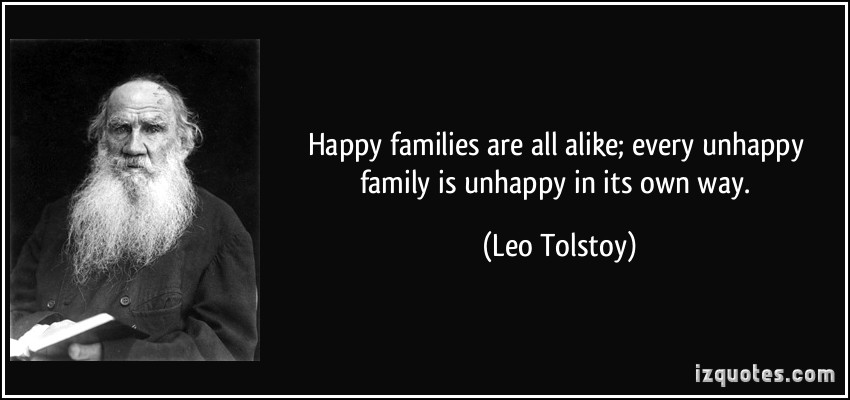

## Motivation





> Like families, tidy datasets are all alike but every messy dataset is messy in its own way - (Hadley Wickham)

http://vimeo.com/33727555

http://vita.had.co.nz/papers/tidy-data.pdf

## Working with data frames

## Tidy data principles

Two guiding principles:

- Each column is a variable
- Each row is an observation

However,

- Un-tidy data are easier for humans to read
- Tidy data are easier for computers to analyse

    
## Example (from tidyr paper)

```{r echo=FALSE,results='asis'}
library(knitr)
untidy <- data.frame(Name = c("John Smith","Jane Doe","Mary Johnson"),treatmenta = c("-",16,3),treatmentb=c(2,11,1))
kable(untidy)
```

http://vita.had.co.nz/papers/tidy-data.pdf

## Re-arranging the data

```{r echo=FALSE,results='asis'}
untidy2 <- t(untidy)
colnames(untidy2) <- untidy2[1,]
untidy2 <- untidy2[-1,]
kable(untidy2)
```

## Definitions

- A dataset is made up of ***values***
- Each value is associated with a ***variable** and an ***observation***
    + variable contains all values that measure the same underlying variable
    + an observation contains all values measured on the same unit
- How many values, variables and observations do we have?

## Answer

- 18 values
- 3 variables
    + Person 
    + Treatment
    + Result
- 6 observations

## Tidy form of the data

- We now have one column for each variable
```{r echo=FALSE,warning=FALSE}
library(tidyr)
suppressPackageStartupMessages(library(dplyr))
gather(untidy, Treatment, Result, treatmenta:treatmentb) %>% mutate(Treatment = gsub("treatment","",Treatment))
```

## The tidyr package

- Two main functions
    + `gather()` and `spread()`
    
## How to use gather

```{r}
untidy <- read.delim("tidyr-example.txt")
untidy
```

## How to use gather

- Creates a column of 'Treatment' keys
    + the variables to use in the original data frame are treatmenta and treatmentb
```{r warning=FALSE}
gather(untidy, Treatment, Result, c(treatmenta,treatmentb))
```


## Example: Simulated clinical data

Using data from the Mango Solutions training dataset

```{r results='asis',echo=FALSE}
library(mangoTraining)
data("messyData")
kable(head(messyData))
```

- What variables and observations do we have?
- What might a 'tidy' version of the dataset look like?

## Tidy form

```{r echo=FALSE, results='asis',message=FALSE}
library(tidyr)
tidy <- gather(messyData,Treatment, Count, -Subject)
```


```{r eval=FALSE}
library(tidyr)
tidy <- gather(messyData,Treatment, Count, -Subject)
```

`separate` from the same package will also sort out the treatment names.

```{r}
separate(tidy,Treatment,into=c("Treatment","Rep"))
```


N.B. spread has the opposite effect to gather and will translate tidy data back into human-readable form

```{r}

spread(tidy, Treatment,Count)
```


## Introducing dplyr

- dplyr is an all-purpose data wrangling tool
- It introduces several 'verbs' that can be used to perform any data manipulation task
    + mutate: create new columns (variables)
    + select: select *columns*
    + filter: select *rows*
    + arrange: re-order arrange rows
    + summarise: summarise values
- Essential reference
    + [dplyr cheatsheet](https://www.rstudio.com/wp-content/uploads/2015/02/data-wrangling-cheatsheet.pdf)

## Example

We are going to explore some of the basic features of R using some patient data; the kind of data that we might encounter in the wild. However, rather than using real-life data we are going to make some up. There is a package called `wakefield` that is particularly convenient for this task.

Various patient characteristics have be generated and saved in the file `patient-data.txt`. 

```{r}
patients <- read.delim("patient-data.txt")
```


In Rstudio , you can view the contents of this data frame in a tab.

```{r eval=FALSE}
View(patients)
```


******

## Q. What are the dimensions of the data frame?

## Q. What columns are available?

******

`patients` can be converted to a special kind of data frame. The main difference is that the whole data frame does not get printed to screen

```{r}
library(dplyr)
patients <- tbl_df(patients)
patients
```


The `tbl_df` function in dplyr creates a new object with more-convenient default display

- The object behaves in exactly the same way as a data frame

```{r}
glimpse(patients)
```

## Selecting variables

The default is to print the data frame in an intelligent manner, so not to flood the R console. If we want to control what variables are printed we can use the `select` function, which allows us to print certain columns to the screen.

In the R introduction, we saw how to extract columns from a data frame with a `$` symbol. 

```{r}
patients$Name
```


```{r}
select(patients, Name)
```

The `$` operator works fine for single columns, but for multiple columns it quickly gets a bit messy as we have to resort to using `[]`

```{r}
patients[,c("Name","Race")]
```

However, `select` is a lot more intuitive

```{r}
select(patients, Name, Race)
```


```{r}
select(patients, -Name)
```


```{r}
select(patients, Name:Sex)
```

Say we cannot remember the name of the column

```{r}
select(patients, starts_with("Grade"))
```

see also
- contains, matches, ends_with

## Transforming / cleaning the data


```{r}
library(stringr)
```

We notice that the Sex column has whitespace

```{r}
table(select(patients, Sex))
as.character(patients$Sex)
str_trim(patients$Sex)
mutate(patients, Sex = str_trim(Sex))
mutate(patients, Sex = factor(str_trim(Sex)))
```

IDs to be padded to 3 digits

```{r}
str_pad(patients$ID,pad = "0",width=3)
mutate(patients, ID=str_pad(patients$ID,pad = "0",width=3))
```

Height contains cm string

```{r}
select(patients,Height)
mutate(patients, Height= str_replace_all(patients$Height,pattern = "cm",""))

```


```{r}
mutate(patients, Height= as.numeric(str_replace_all(patients$Height,pattern = "cm","")))
```


Grade has invalid values

```{r}
grds <- patients$Grade_Level
ifelse(grds == 99, NA,grds)
```

## Dealing with dates

```{r}
str_sub(patients$Birth,1,4)
```


```{r}
year(patients$Birth)
```


```{r}
library(lubridate)
dob <- ymd(patients$Birth)
today <- ymd("20160203")
age <- new_interval(dob, today) / years(1)
mutate(patients, Age = new_interval(dob, today) / years(1))

```

******

## Exercise

- Read the Florence Nighingale dataset from `Nightingale.txt` and 
- Transform into a tidy dataset
- Add a Rate column 
- Add a column that contains the year
- Add whether the date occured before or after the regime change of 3rd January 1855

```{r echo=FALSE}
ngale <- read.delim("Nightingale.txt") %>%  
  tbl_df %>% 
  gather(Cause, Deaths, Disease:Other) %>% 
  mutate(Rate = round(12 * 1000 * Deaths /Army,1)) %>% 
  mutate(Date = ymd(Date),Year = year(Date), Month = month.abb[month(Date)]) %>% 
  mutate(Regime = ifelse(Date > ymd("1855-03-01"), "After","Before"))
ngale

```

