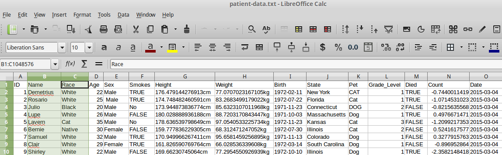

# Overview of this section

- tidy data
    + what it means
    + how to create it
- `select` and `mutate` verbs in dplyr
- advice for cleaning strings

As we saw, our data, and especially data we might find out "in the wild", may need "cleaning"" before we can use it


> Like families, tidy datasets are all alike but every messy dataset is messy in its own way - (Hadley Wickham)

http://vimeo.com/33727555

http://vita.had.co.nz/papers/tidy-data.pdf


## Example (from tidyr paper)

Consider the following....

```{r echo=FALSE,results='asis'}
library(knitr)
untidy <- data.frame(Name = c("John Smith","Jane Doe","Mary Johnson"),treatmenta = c("-",16,3),treatmentb=c(2,11,1))
kable(untidy)
```

http://vita.had.co.nz/papers/tidy-data.pdf

- A dataset is made up of ***values***
- Each value is associated with a ***variable** and an ***observation***
    + variable contains all values that measure the same underlying variable
    + an observation contains all values measured on the same unit

In this example dataset we have *18* values and *3* variables

1. Person (John, Jane or Mary)
2. Treatment (A or B)
3. "Result"


The guiding principles:

- Each column is a variable
- Each row is an observation
- Each type of observational unit forms a table

The tidy form of this data thus becomes;


```{r echo=FALSE,warning=FALSE}
library(tidyr)
suppressPackageStartupMessages(library(dplyr))
gather(untidy, Treatment, Result, treatmenta:treatmentb) %>% mutate(Treatment = gsub("treatment","",Treatment))
```


We can notice that;

- Un-tidy data are easier for humans to read
- Tidy data are easier for computers to analyse

We have already seen a tidy dataset in the form of `iris`

```{r}
head(iris)
```

    
## The tidyr package

- Two main functions
    + `gather()` and `spread()`
    

```{r}
untidy <- read.delim("tidyr-example.txt")
untidy
```

`gather` is the function that can collapse multiple columns into key-value pairs. 

- similar to `stack` in base R
- or `melt` in the `reshape` / `reshape2` pacakges

The arguments are;

- the data frame you want to manipulate
- the name of the *key* column you want to create
- the name of the *value* column you want to create
- the *names* of the columns in the data frame that are to be collapsed
    + note you don't need "" to define the column names
        

```{r warning=FALSE}
gather(untidy, Treatment, Result, c(treatmenta,treatmentb))
```

When specifying columns, an alternative is to ignore some column names

```{r warning=FALSE}
gather(untidy, Treatment, Result, -Name)
```

Can also specify column index

```{r warning=FALSE}
gather(untidy, Treatment, Result, 2:3)
```

Note that after all these operations, the original data frame (`untidy`) is unaltered
  - we need to create a new variable to save the result

```{r}
untidy
tidy <- gather(untidy, Treatment, Result, c(treatmenta,treatmentb))
```

******

## Example: Simulated clinical data

Using data from the Mango Solutions training dataset

```{r results='asis',echo=FALSE}
library(mangoTraining)
data("messyData")
kable(head(messyData))
```

- What variables and observations do we have?
- What might a 'tidy' version of the dataset look like?
- Use the `tidyr` package to create a tidy version of the data

******

## Tidy form

```{r echo=FALSE, results='asis',message=FALSE}
library(tidyr)
tidy <- gather(messyData,Treatment, Count, -Subject)
```

```{r echo=FALSE}
head(tidy)
```


```{r eval=FALSE}
library(tidyr)
tidy <- gather(messyData,Treatment, Count, -Subject)
```

`separate` from the same package will also sort out the treatment names.

```{r eval=FALSE}
separate(tidy,Treatment,into=c("Treatment","Rep"))
```

```{r echo=FALSE}
head(separate(tidy,Treatment,into=c("Treatment","Rep")))
```


N.B. `spread` has the opposite effect to gather and will translate tidy data back into human-readable form

```{r eval=FALSE}
spread(tidy, Treatment,Count)
```

```{r echo=FALSE}
head(spread(tidy, Treatment,Count))
```


## dpylr introduction, and more data-cleaning

We are going to explore some of the basic features of `dplyr` using some patient data; the kind of data that we might encounter in the wild. However, rather than using real-life data we are going to make some up. There is a package called `wakefield` that is particularly convenient for this task.

Various patient characteristics have been generated and saved in the file `patient-data.txt`. 

```{r}
patients <- read.delim("patient-data.txt")
```


In Rstudio , you can view the contents of this data frame in a tab.

```{r eval=FALSE}
View(patients)
```


`patients` can be converted to a special kind of data frame. The main difference is that the whole data frame does not get printed to screen

```{r}
library(dplyr)
patients <- tbl_df(patients)
patients
```


The `tbl_df` function in dplyr creates a new object with more-convenient default display

- The object behaves in exactly the same way as a data frame
- `glimpse` can be used to get a snapshot of your data
    + similar to `str` function in base R

```{r}
glimpse(patients)
```

## Selecting variables; the `select` verb



The default is to print the data frame in an intelligent manner, so not to flood the R console. If we want to control what variables are printed we can use the `select` function, which allows us to print certain columns to the screen.


In the R introduction, we saw how to extract columns from a data frame with a `$` symbol. 

  - Remember that we're not changing the data frame, just exploring it

```{r}
patients$Name
```

The `$` operator works fine for single columns, but for multiple columns it quickly gets a bit messy as we have to resort to using `[]`

```{r}
patients[,c("Name","Race")]
```

However, `select` is a lot more intuitive

  - Notice the lack of `""`

```{r}
select(patients, Name)
```


```{r}
select(patients, Name, Race)
```


```{r}
select(patients, -Name)
```


```{r}
select(patients, Name:Sex)
```

Say we cannot remember the name of the column

```{r}
select(patients, starts_with("Grade"))
```

see also

- contains, matches, ends_with

## Transforming / cleaning the data


We can now begin to explore the data. Imagine that we want to do a simple barplot to the number of males and females. Using base graphics, we can do this with;

```{r}
barplot(table(patients$Sex))
```

******

- What do you think the problem might be?
- Try printing out all values for this column, or using the `nchar` function to determine the problem

******

So we notice that the Sex column has "whitespace"; not an uncommon problem if data have been entered manually.


```{r}
table(select(patients, Sex))
as.character(patients$Sex)
```

The base distribution of R has many functions for dealing with strings. However, the `stringr` package (again from Hadley Wickham) aims to provide a clean modern interface to many common string operations.

Of particular interest here is the `str_trim` (`?str_trim`) function that will trim whitespace from a vector of strings. Arguments can be used to specify whether to remove whitespace from either side of the string, or just the left or right. 

```{r}
library(stringr)
str_trim(patients$Sex)
```

Once we have worked-out how to created a cleaned version of the variable, we need to update the data frame. This can be done using the next of the **dplyr verbs**; `mutate`.

`mutate` allows us to compute and append one or more new columns to a data frame. Notice that we keep our original data intact and create a new cleaned data frame

```{r}
mutate(patients, Sex = str_trim(Sex))
patients_clean <- mutate(patients, Sex = factor(str_trim(Sex)))
```

Rather than removing whitespace, sometimes we might want to adjust a set of strings so that they have a fixed width. We can do this be adding a *padding* character to each string if necessary. This operations is often done with a set of identifiers.

```{r}
str_pad(patients$ID,pad = "0",width=3)
patients_clean <- mutate(patients_clean, ID=str_pad(patients_clean$ID,pad = "0",width=3))
```

Similarly, we might want to trim all the strings between a particular start and end position

```{r}
str_sub(patients$State, 1,3)
str_sub(patients$Name, 2,5)
```

Finally, we can convert entire strings to upper- or lower-case

```{r}
str_to_lower(patients$Pet)
str_to_upper(patients$Name)
```

## String Replacement

We might want to look at the distribution of heights amongst our patients. However, if we try this we are immediately hit with an error message

```{r eval=FALSE}
hist(patients$Height)
```

```{r echo=FALSE}
err <- try(hist(patients$Height),silent = TRUE)
cat(err)
```

The problem is that R thinks that values are not numbers. Why might that be?

```{r}
select(patients,Height)
```

To convert the values back to numbers we first need to remove the `"cm""` at the end of each value. We can do this with a *string replacement* operation. In this case, the particular string we want to put in the place of `"cm"` is the *empty string* `""`. The replacement can be done using the `str_replace_all` function.


```{r}
mutate(patients_clean, Height= str_replace_all(patients_clean$Height,pattern = "cm",""))
```

However, what do you notice about the class reported for the Height column after this operation. [compare to the `Count` column for example]

We need an extra conversion step.

```{r}
patients_clean <- mutate(patients_clean, Height= as.numeric(str_replace_all(patients_clean$Height,pattern = "cm","")))
hist(patients_clean$Height)
```


```{r}
patients$Grade_Level
```


Grade has invalid values

```{r}
grds <- patients$Grade_Level
ifelse(grds == 99, NA,grds)
patients_clean <- mutate(patients_clean, Grade = ifelse(grds == 99, NA,grds))
```

## Dealing with dates

```{r}
str_sub(patients$Birth,1,4)
```

The `lubridate` package has lots of useful functions for dealing with dates

```{r}
library(lubridate)
year(patients$Birth)
```


```{r}

dob <- ymd(patients$Birth)
today <- ymd("20160203")
age <- interval(dob, today) 
as.period(age)

patients_clean <- mutate(patients_clean, Age = year(as.period(age)))
patients_clean
```


## Exercise

- We want to calculate the Body Mass Index (BMI) for each of our patients
- $BMI = (Weight) / (Height^2)$ 
    + where Weight is measured in Kilograms, and Height in Metres
- A BMI of 25 is considered overweight, calculate a new variable to indicate which individuals are overweight
- For a follow-on study, we are interested in overweight smokers
    + create a "candidate" variable to indicate individuals that would be candidates for this study

```{r echo=FALSE}
patients_clean <- mutate(patients_clean, Weight = as.numeric(str_replace_all(patients_clean$Weight,"kg","")))
patients_clean <- mutate(patients_clean, BMI = (Weight/(Height/100)^2), Overweight = BMI > 25)
patients_clean <- mutate(patients_clean, Smokes = str_replace_all(Smokes, "Yes", TRUE))
patients_clean <- mutate(patients_clean, Smokes = as.logical(str_replace_all(Smokes, "No", FALSE)))
patients_clean <- mutate(patients_clean, Candidate = Smokes & Overweight)
patients_clean
```


