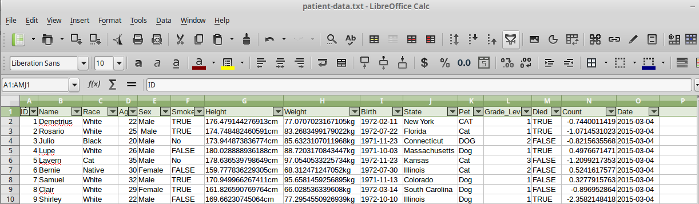

# Overview of this section

- Introducing piping
- **filter** verb
- **arrange** verb

```{r echo=FALSE}
suppressPackageStartupMessages(library(dplyr))
library(stringr)
library(tidyr)
patients <- tbl_df(read.delim("patient-data.txt"))
```


## Introducing piping

The output of one operations gets used as the input of the next

In computing, this is referring to as *piping* 
- unix commands use the `|` symbol

## magrittr


- the magrittr library implements this in R

## Why do we need this?

We've ended up with a long chain of commands

- prone to error if we copy-and paste
- notice how the output of one line is the input to the following line

```{r}

patients_clean<- mutate(patients, Sex = factor(str_trim(Sex)))
patients_clean <- mutate(patients_clean, ID=str_pad(patients_clean$ID,pad = "0",width=3))
patients_clean <- mutate(patients_clean, Height= str_replace_all(patients_clean$Height,pattern = "cm",""))
```


## Simple example

```{r eval=FALSE}
patients <- read.delim("patient-data.txt")
head(patients)

patients %>% head

```

We can re-write our steps from above;

```{r}
patients_clean <-
  mutate(patients, Sex = factor(str_trim(Sex))) %>% 
  mutate(ID=str_pad(ID,pad = "0",width=3)) %>% 
  mutate(Height= as.numeric(str_replace_all(Height,pattern = "cm","")))
patients_clean
```


******

Take the dataset including the BMI measurements

Re-write in the piping framework
Add a step to print just the ID, Name, Date of Birth, Smokes and Overweight columns

******

```{r}
mutate(patients_clean, Weight = as.numeric(str_replace_all(patients_clean$Weight,"kg",""))) %>% 
  mutate(BMI = (Weight/(Height/100)^2), Overweight = BMI > 25) %>% 
  mutate(Smokes = str_replace_all(Smokes, "Yes", TRUE)) %>% 
  mutate(Smokes = as.logical(str_replace_all(Smokes, "No", FALSE))) %>% 
  mutate(Candidate = Smokes & Overweight) %>% 
  select(ID, Name, Birth,BMI,Smokes,Overweight)

```


## Selecting rows: **filter**



The **`filter``** verb is used to select rows from the data frame

```{r}
filter(patients, Sex == "Male") 
```

```{r}
filter(patients, Sex == "Male" & Died)
```

```{r}
filter(patients, Sex != "Male" | Grade_Level > 1)
```


******

Modify the workflow to select the candidates (overweight smokers)

******


```{r}
mutate(patients_clean, Weight = as.numeric(str_replace_all(patients_clean$Weight,"kg",""))) %>% 
  mutate(BMI = (Weight/(Height/100)^2), Overweight = BMI > 25) %>% 
  mutate(Smokes = str_replace_all(Smokes, "Yes", TRUE)) %>% 
  mutate(Smokes = as.logical(str_replace_all(Smokes, "No", FALSE))) %>% 
  mutate(Candidate = Smokes & Overweight) %>% 
  filter(Smokes & Overweight) %>% 
  select(ID, Name, Birth,Smokes,Overweight)

```

```{r}
arrange(patients, Height)
```

